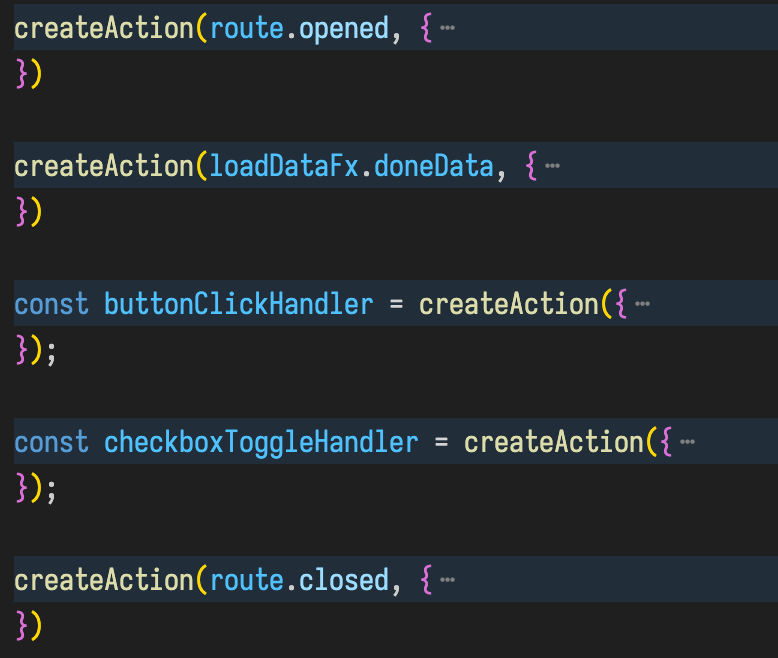
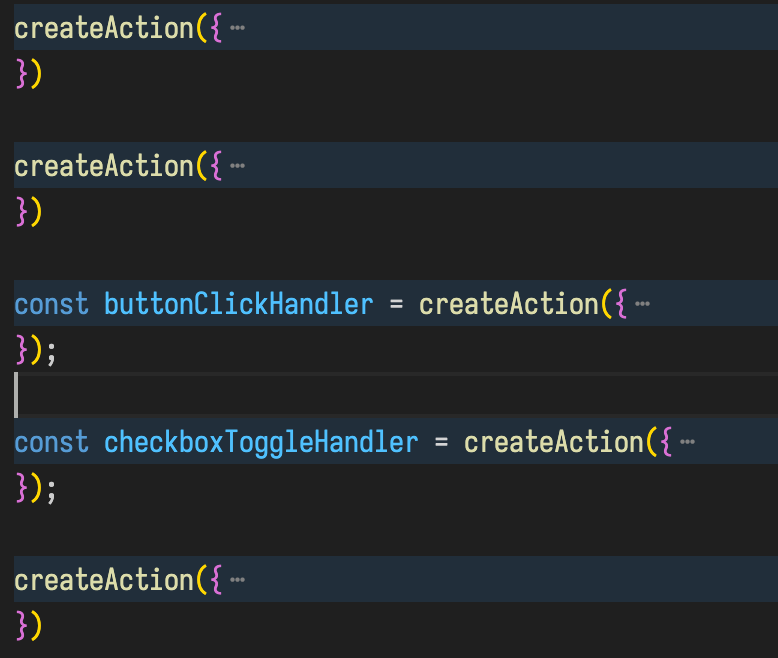
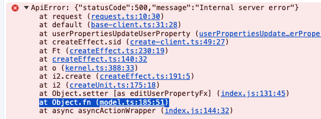

# Effector Action

This library provides api which allows changing the state of stores or calling events in an imperative style without breaking the static approach of the Effector. This should eliminate the problem when one synchronous task is split into several samples, or when the task turns into a mess of nested samples, conditions and splits.
Therefore this abstraction can serve as a convenient replacement for one or more synchronous operators that are responsible for a single action.

- [Library status](#library-status)
- [Install](#install)
- [createAction](#createaction)
  - [Usage](#usage)
    - [Change units](#change-units)
    - [Change store using reducer func](#change-store-using-reducer-func)
    - [Reset store](#reset-store)
    - [Clock](#clock)
    - [Alternative api for external clock usage (Recommended)](#alternative-api-for-external-clock-usage-recommended)
    - [Source](#source)
    - [Removing dollar prefix from store names in source](#removing-dollar-prefix-from-store-names-in-source)
  - [Limitation](#limitation)
  - [Under the hood](#under-the-hood)
- [createAsyncAction](#createasyncaction)
  - [Usage](#usage-1)
  - [Source](#source-1)
  - [Return value](#return-value)
  - [Action paramaters](#action-parameters)
  - [Circular references](#circular-references)
  - [Limitation](#async-action-limitation)
  - [Error logging](#error-logging)
- [Parameter type inference](#parameter-type-inference)

## Library status

This library (createAction) is production ready, and [officially recommended](https://effector.dev/en/guides/best-practices/#create-action) for use by Effector community.

Also `createAction` [will be moved to the Effector core API in the next major release](https://github.com/effector/effector/issues/1275), so start using it now.

## Install

```bash
npm i --save effector-action
```

This requires effector >=23 and patronum >=2.1.0.

## createAction

### Usage

#### Change units

All units in `target` are available for change in `fn`. To change the value of a store or trigger an event simply call it and pass the appropriate value.

```ts
import { createAction } from 'effector-action';

const $store = createStore('');
const event = createEvent<number>();
const effectFx = createEffect<boolean, void>();

const changeValues = createAction({
  target: {
    $store,
    event,
    effectFx,
  },
  fn: (target) => {
    target.$store('foo');
    target.event(123);
    target.effectFx(false);
  },
});

changeValues();
```

Or you can change single unit

```ts
import { createAction } from 'effector-action';

const $store = createStore('');

const changeValue = createAction({
  target: $store,
  fn: (target) => {
    target('foo');
  },
});

changeValue();
```

You can change the specified units by condition

```ts
const changeValues = createAction({
  target: {
    $store,
    event,
    effectFx,
  },
  fn: (target) => {
    const condition = Math.random() > 0.5;

    if (condition) {
      target.$store('foo');
    } else {
      target.event(123);
    }

    target.effectFx(condition);
  },
});

changeValues();
```

#### Change store using reducer func

You can change store values ​​using the reducer function and based on the current state of the store.

```ts
const inc = createAction({
  target: {
    $counter,
  },
  fn: (target) => {
    target.$counter((counter) => counter + 1); // get current counter state and increment it
  },
});
```

### Reset store

You can just reset store using the reinit method.

```ts
const $store = createStore('');

const changeValues = createAction({
  target: {
    $store,
  },
  fn: (target) => {
    target.$store.reinit();
  },
});
```

#### Clock

To run `fn` you need to trigger the clock.
Clock can be specified in the clock field

```ts
createAction({
  clock: $store,
  target,
  fn,
});

createAction({
  clock: [$store, event],
  target,
  fn,
});
```

Clock value is available in the last parameter of `fn`

```ts
const clock = createEvent<string>();

createAction({
  clock: [$store, event],
  target,
  fn: (target, clock) => {
    // clock is string
    target.$someStore(clock.toLowerCase());
  },
});
```

If clock is not specified then `createAction` will return event as clock

```ts
const clock = createAction({
  target,
  fn,
});
```

To specify the type for the returned clock you need to manually add it

```ts
const clock = createAction({
  target,
  fn: (target, clock: string) => {}, // specify clock type
});

// clock = Event<string>
```

#### Alternative api for external clock usage

You can specify external clock in the first argument.

```ts
const inputChanged = createEvent<string>();
const $lowerCaseInput = createStore('');

createAction(inputChanged, {
  target: { $lowerCaseInput },
  fn: (target, clock) => {
    target.$lowerCaseInput(clock.toLowerCase());
  },
});
```

I recommend using this method because you can see the clock name even if the code blocks are folded in your ide.



VS When clock is in the config you don't see its name



### Source

Analog of source from `sample`. Source values ​​are available in the second parameter of `fn`

```ts
const clock = createAction({
    source: {
        foo: $store1,
        bar: $store2
    }
    target,
    fn: (target, { foo, bar }, clock: string) => {};
})
```

### Removing dollar prefix from store names in source

To avoid duplication of store names in the source, dollar prefixes are removed automatically

```ts
const clock = createAction({
    source: {
        $longStoreName1 // short naming
        longStoreName2: $longStoreName2 // default naming
    }
    target,
    fn: (
      target, { longStoreName1, longStoreName2 }, clock: string) => {
        target.doSomething(longStoreName1) // dollar prefix removed!
      };
})
```

### Limitation

#### Functions that change units should be called no more than once.

If it was called multiple times, only the last call will be counted.

```ts
const changeValues = createAction({
  target: {
    $store,
  },
  fn: (target) => {
    target.$store('foo');
    target.$store('bar'); // only last call will be counted
  },
});

changeValue();

$store; // state = bar
```

#### Only sync function allowed in fn

```ts
const changeValues = createAction({
  target: {
    $users,
  },
  fn: async (target) => {
    const data = await loadUsers();

    target.$users(data); // will not work!
  },
});
```

### Under the hood

Under the hood it's an abstraction over sample and **_[patronum/spread](https://patronum.effector.dev/methods/spread/)_**.

```ts
const clock = createEvent();

createAction({
  clock,
  source: { foo: $foo, bar: $bar },
  target: {
    event,
    $store,
    effectFx,
  },
  fn: (target, { foo, bar }, clock) => {
    const condition = Math.random() > 0.5;

    if (condition) {
      target.event(foo);
    } else {
      target.$store(bar);
    }

    target.effectFx(clock);
  },
});

// is equivalent to

sample({
  clock,
  source: { foo: $foo, bar: $bar },
  fn: ({ foo, bar }, clock) => {
    const result = {};

    const condition = Math.random() > 0.5;

    if (condition) {
      result['event'] = foo;
    } else {
      result['$store'] = bar;
    }

    result['effectFx'] = clock;

    return result;
  },
  target: spread({
    event,
    $store,
    effectFx,
  }),
});
```

## createAsyncAction

Similar to createAction, but allows waiting for effects passed to target to complete. Returns an effect as a result.

See live example: https://stackblitz.com/edit/react-ts-z9yaunuk?file=App.tsx

### Usage

```ts
const $draftUserName = createStore('');
const $user = createStore<User | null>(null);
const updateUserFx = createEffect<{ id: string } & Partial<User>, User>();

const updateUserNameFx = createAsyncAction({
    source: {
        $draftUserName,
        $user
    },
    target: {
        $user,
        showNotificationFx,
        updateUserFx,
    },
    fn: async (target, getSource) => {
        const { draftUserName, user } = await getSource();

        if (!user) return;

        try {
            const updatedUser = await target.updateUserFx({
                id: user.id,
                name: draftUserName,
            });
            target.$user(updatedUser);
            target.showNotificationFx({
                type: 'info',
                text: 'User updated',
            });
        } catch {
            target.showNotificationFx({
                type: 'warning',
                text: 'User update failed',
            });
        }
    }
});

const $isUserUpdating = updateUserName.pending;


  // react
  const onUpdateUserName = useUnit(updateUserName);
  const isUserUpdating = useUnit($isUserUpdating);

  // ...

  <Button
    onClick={onUpdateUserName}
    loading={isUserUpdating}
  >
    Submit
  </Button>
```

### Source

To get the source value, use the asynchronous getSource function. It allows obtaining up-to-date source values after asynchronous effect calls.

```ts
const $user = createStore<User | null>(null);
const loadUserFx = createEffect<void, User>();

sample({
  clock: loadUserFx.doneData,
  target: $user,
});

const updateUserNameFx = createAsyncAction({
  source: $user,
  target: {
    loadUserFx,
  },
  fn: async (target, getSource) => {
    const user = await getSource(); // user === null

    await target.loadUserFx();

    // get actual source value after loadUserFx.doneData
    const updatedUser = await getSource(); // user === User
  },
});
```

### Return value

Async action can return value like usual effect.

```ts
const updateUserNameFx = createAsyncAction({
  target: {
    $someStore,
    someEffectFx,
  },
  fn: async (target, getSource) => {
    const result = await target.someEffectFx(); // 10
    target.$someStore(result); // change units
    return result; // return value
  },
});

sample({
  clock: updateUserNameFx.doneData,
  fn: (result) => {
    // result = 10
  },
});
```

### Action parameters

Like in a regular action, you can pass parameters.

```ts
const onUserNameChangeFx = createAsyncAction({
  target: {},
  fn: (target, userName: string) => {
    // ...
  },
});
```

### Circular references

Async action can reference units declared below in the code, or reference itself. To do this, you need to pass a function that returns the action config.
Important!: If you pass a function with the config, the action initialization will occur in the next microtask, and synchronous calls to the action before its initialization will result in an error.

Using units declared below in the code:
```ts
const actionFx = createAsyncAction(() => ({
    source: $someStore,
    target: {
      someEvent
    },
    fn: (target, getSourceFx) => {
      // ...
    }

}));

const $someStore = createStore(0);
const someEvent = createEvent();
```

Self-reference:
```ts
// need to manually specify type when self-referencing
const updateUserFx: Effect<User, User> = createAsyncAction(() => ({
  source: {
    $isUpdating: updateUserFx.pending, // self reference
  },
  target: { /*...*/ },
  fn: async (target, getSource) => {
    const { isUpdating } = await getSource();
    if (isUpdating) return;
    // ...
  }
}));
```

WRONG USAGE:
```ts
const actionFx = createAsyncAction(() => ({
    target: {
      someEvent
    },
    fn: (target, getSourceFx) => {
      // ...
    }

}));

const someEvent = createEvent();

actionFx(); // Error: actionFx is not initialized
```

### Async Action Limitation

#### Functions that change units should be called no more than once in one tick.

You can call the same function multiple times if they are called in different micro tasks.
Calling the same function in a single tick will result in an error.

WRONG. multiple calls in single tick

```ts
fn: (target) => {
  target.$store('foo');
  target.$store('bar'); // Error
},
```

WRONG. multiple calls in single tick

```ts
async fn: (target) => {
  const result = await Promise([
    target.someFx(1);
    target.someFx(2); // Error
  ]);
},
```

OK. multiple calls in different ticks

```ts
fn: (target) => {
  target.$store('foo');
  await target.someFx(1);
  target.$store('bar');
},
```

### Error logging

Unlike effects, when an error occurs in Async Action, it will be logged using `console.error`. The location where the error occurred specifically in Async Action can be traced through the stack trace. It will be located near the asyncActionWrapper function.



## Parameter type inference

The parameter type for Action and AsyncAction can be inferred from the function parameter types.

```ts
const formModel = <FormSchema>(params: { onSubmit: UnitTargetable<FormSchema> }) => {
  // ...
};

const form1 = formModel<User>({
  onSubmit: createAction({
    target: {},
    fn: (target, user) => {
      // inferred
      // user === User
    },
  }),
});

const form2 = formModel<User>({
  onSubmit: createAsyncAction({
    target: {},
    fn: (target, user) => {
      // inferred
      // user === User
    },
  }),
});
```
